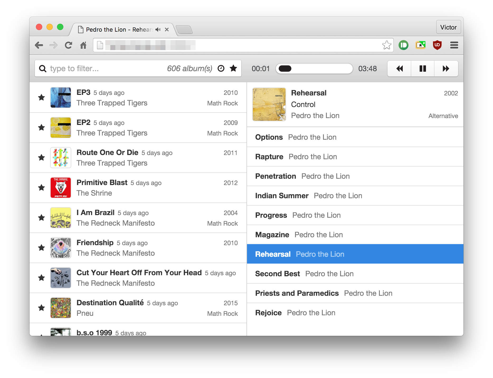

# headbang

headbang is a self-hosted web-based music player built on top of nodejs and react.



## features

* minimalist but powerful interface
* lightweight and fast even with large libraries
* super easy installation, self-contained dependencies

## installation and usage

headbang is available on `npm`. to install it just run:

```
npm install -g headbang-cli
```

after installation run it by executing:

```
headbang --last-fm=YOURKEY /path/to/music
```

## building

```
git clone git@github.com:knoopx/headbang.git
cd headbang
npm install
gulp cli:build
npm install -g build/cli
```

## development

edit `live-server.js` to point your library and run `gulp`.
a development server with css and react hot reloading will boot.
